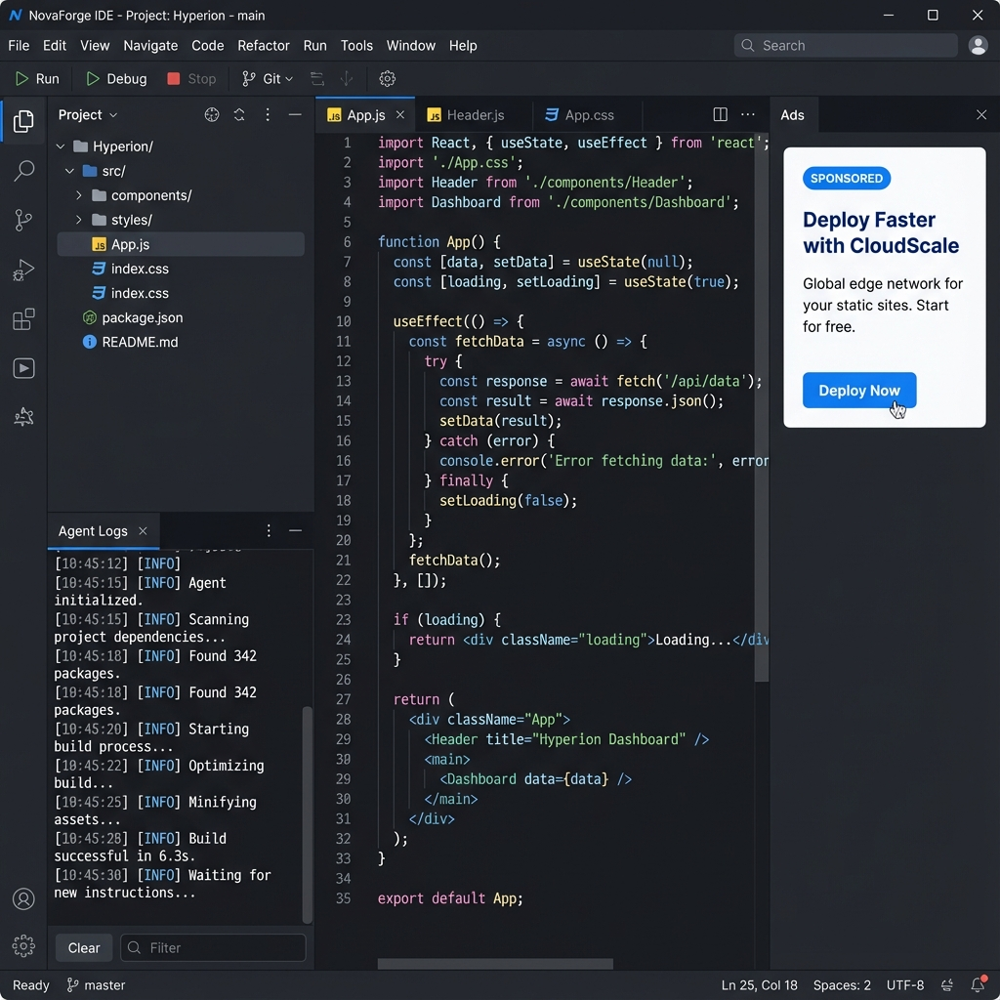

# NovaForge IDE



**NovaForge** is a next-generation custom IDE built on the robust foundation of Visual Studio Code. It integrates intelligent agentic workflows and a sustainable ad-supported model directly into your development environment.

## 🚀 Key Features

### 🤖 Built-in AI Agent
NovaForge comes with a powerful AI Agent integrated into the workbench.
-   **Task Execution**: Run complex coding tasks (refactoring, analysis, generation) directly from the IDE.
-   **Live Logs**: Watch the agent think and act in real-time via the dedicated "Agent Logs" view.
-   **Command Palette Integration**: Trigger agent tasks seamlessly with `Cmd+Shift+P` -> "Run Agent Task".

### 📢 Context-Aware Ad System
A non-intrusive, ethical ad system that supports the development of free tools.
-   **Smart Visibility**: Ads appear *only* when the AI Agent is actively working for you, keeping your coding flow distraction-free.
-   **Sandboxed Security**: All ads run in a secure, sandboxed iframe to ensure they never interfere with your code or security.
-   **Integrated UI**: Ads are displayed in the Auxiliary Bar, blending perfectly with the IDE's aesthetics.

### 🎨 Custom Branding
-   **Identity**: Fully rebranded experience with custom product metadata.
-   **Modern Look**: Designed to feel premium and professional.

## 🛠️ Getting Started

### Prerequisites
-   Node.js (v20+)
-   npm

### Installation

1.  **Clone the Repository**
    ```bash
    git clone https://github.com/whyujjwal/novaforge.git
    cd novaforge
    ```

2.  **Install Dependencies**
    ```bash
    npm install
    ```

3.  **Start the Mock Ad Server**
    (Required to see ads)
    ```bash
    node scripts/mock-ads-server.js
    ```

4.  **Run NovaForge**
    ```bash
    npm run watch
    ```

## 📂 Project Structure

-   `src/vs/workbench/contrib/ads`: Ad System implementation (React component, Contribution).
-   `src/vs/workbench/contrib/agent`: AI Agent implementation (Service, View, Commands).
-   `scripts/mock-ads-server.js`: Local server for testing ad delivery.

## 🤝 Contributing

Contributions are welcome! Please feel free to submit a Pull Request.

## 📄 License

Based on [Visual Studio Code](https://github.com/microsoft/vscode), licensed under the MIT License.
